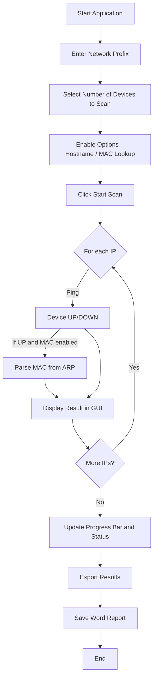

# 🛰️ Basic Network Scanner with MAC Address Lookup

A Python-based graphical network scanning tool that performs device reachability checks (via ping), resolves hostnames, and optionally performs MAC address lookups using the ARP table. Results are displayed in real-time and can be exported to a formatted Word report.

---

## 📌 Features

- 🔍 Scans multiple IP addresses in a given subnet
- 🌐 Optional hostname resolution
- 🧭 Optional MAC address lookup using ARP table
- 📊 Real-time progress bar and device status updates
- 📋 Auto-scroll log area with color-coded output (🟢 UP, 🔴 DOWN)
- 📁 Export scan results to a `.docx` Word file
- 🖱️ Modern GUI with checkboxes, combobox, and status labels

---

## 🧱 GUI Overview

### Screenshot


IP  NETWORK


### Flowchart



---

## 🚀 How to Run

### 🪜 Step-by-Step Process

1. ** Download the Project**\
   Download the ZIP or run:

   ```bash
   https://github.com/DeyArijeet/Basic-Network-Scanner.git
   ```

2. **Install Dependencies**\
   Make sure Python is installed (Python 3.6+). Then install the required package:

   ```bash
   pip install python-docx
   ```

3. **Run the Application**\
   Launch the scanner using:

   ```bash
   python network_scanner_mac_gui.py
   ```

4. **Using the GUI**

   - Enter your local network prefix (e.g., `192.168.1`)
   - Select the number of devices to scan
   - Optionally enable hostname and MAC / WINDOWS address lookup
   - Click `Start Scan` to begin
   - Export results with `Export to Word`

---

### 🔧 Requirements

Install the dependencies:

```bash
pip install python-docx
```

### ▶️ Run the Application

```bash
python network_scanner_mac_gui.py
```

---

## 📄 Exported Report Example

The exported `.docx` file includes:

- Network prefix
- Number of devices scanned
- Timestamp
- Table with:
  - IP address
  - Hostname (if resolved)
  - Status (🟢 UP / 🔴 DOWN)
  - MAC address (if enabled)

---

## 📂 Project Structure

```
.
├── network_scanner_mac_gui.py     # Main GUI application
├── screenshots/
│   └── network_scanner_gui.png    # Example UI screenshot
├── README.md                      # This documentation
└── requirements.txt               # Dependencies
```

---

## 🧠 Tech Stack

- Python 3.x
- Tkinter (GUI)
- subprocess / socket / platform (system ops)
- `python-docx` (export to Word)

---

## 📌 Author

**Arijeet Dey**

Built for Kali Linux Edition with a Windows/Mac -compatible interface.

---

## 🛠️ Future Improvements

- CSV/PDF export support
- Port scanning functionality
- MAC vendor lookup from IEEE
- Logging to local file automatically
- Executable packaging for Windows/Mac (.exe)

---

## ✅ License

Open-source and free to use. Attribution appreciated.

